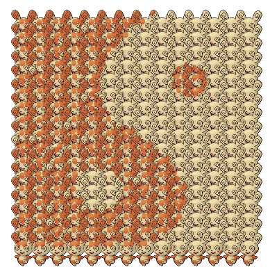

# Spindafy
This is a simple script to find a personality value (PID) that most closely matches a target image when applied as a pattern to the Pokémon Spinda!

It consists of the following files:
- ``spindafy.py`` defines the ``SpindaConfig`` class, representing a Spinda point configuration. It also contains a method to render the pattern to a PIL Image, compare it to a target image, an to check whether a pixel is within a spot's area.
- ``spinda_optimizer.py`` defines a *very* simple genetic algorithm to try and find a good PID for a given input image.
- ``spinda_anim.py`` just runs the genetic algorithm on a number of files in a given directory and writes the results to a different directory (both given as command line arguments.) See [this YouTube video](https://www.youtube.com/watch?v=ZzsBIfA6iog) for an example.
- ``large_spinda.py`` implements a super naive and *very* slow spinda mosaic generator. Example:
  